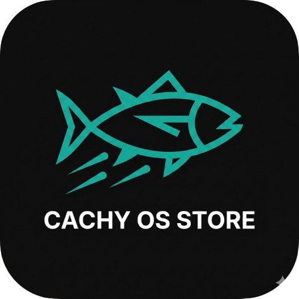
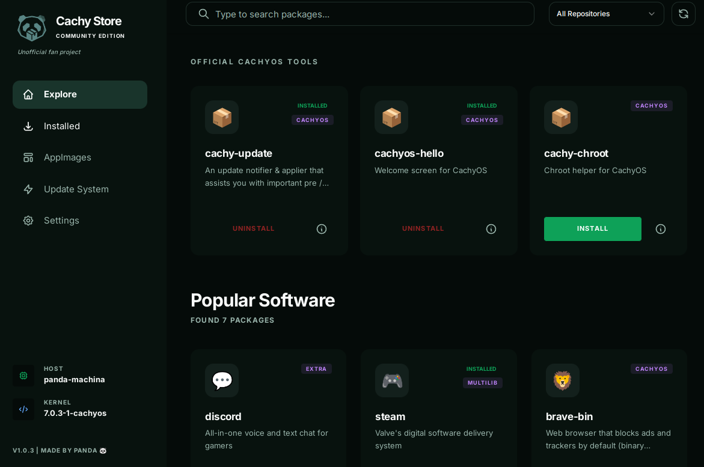
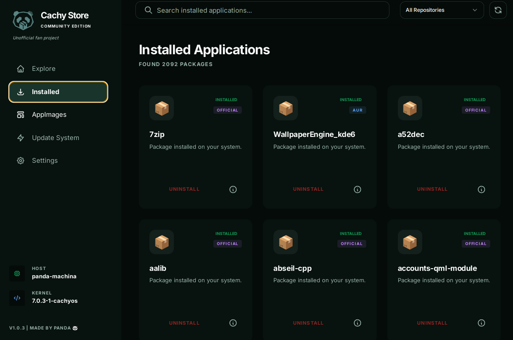
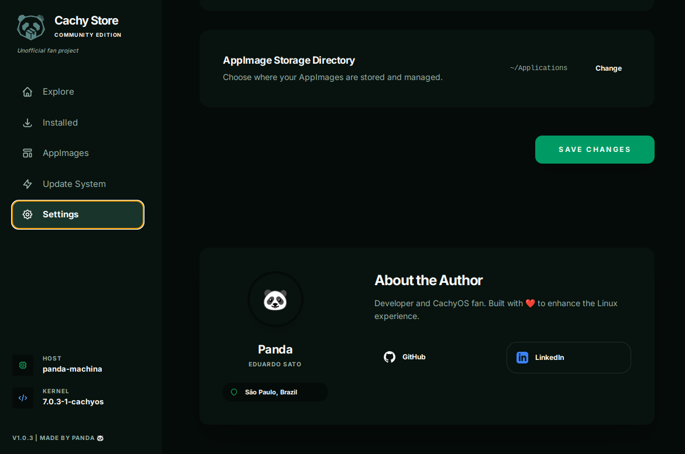
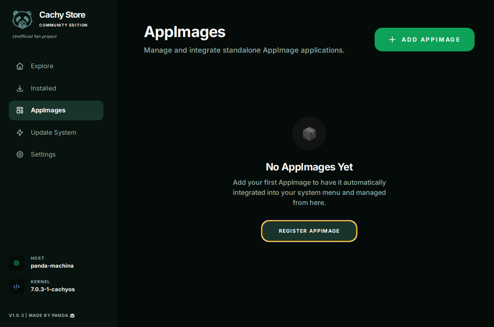
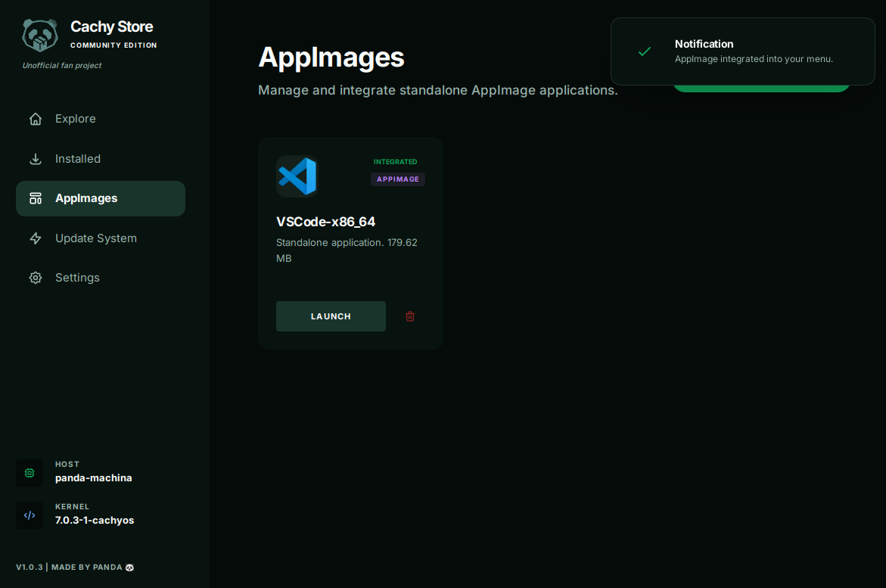

# 🐼 CachyOS Store (Community Edition)

<p align="center">
  
</p>

<p align="center">
    <a href="https://github.com/satodu/panda-cachy-store/releases">
        
    </a>
    <a href="LICENSE">
        
    </a>
    <a href="https://satodu.github.io/panda-cachy-store/">
        
    </a>
</p>

<p align="center">
  <b>🌐 Check the official website: <a href="https://satodu.github.io/panda-cachy-store/">satodu.github.io/panda-cachy-store/</a></b>
</p>

A modern, high-performance, and beautiful community-driven store for **CachyOS**, built with **Laravel**, **Livewire (Volt)**, and **NativePHP**.

> [!IMPORTANT]
> **UNOFFICIAL FAN PROJECT**: This application is not an official product of the CachyOS team. It is a fan-made project created by **Panda** to enhance the software management experience on CachyOS.

---

## 📸 Visual Preview

<p align="center">
  
</p>

<div align="center">
  
  
</div>

<br>

<div align="center">
  
  
</div>

---

## ✨ Features

- **⚙️ AppImage Management (Gear Lever Style)**: Integrated manager to integrate, launch, and uninstall AppImages. Automatically handles icon extraction and desktop menu entries.
- **📦 Flatpak Support** *(New in v1.1.1)*: Browse, install, update, and remove Flatpak applications directly from the store. Enable or disable Flatpak integration at any time from Settings.
- **🚀 Performance-First**: Intelligent caching system for lightning-fast search results.
- **💎 Shadcn UI Aesthetic**: Clean, professional, and minimalist design based on the Zinc theme.
- **📦 AUR Integration**: Search and install community packages directly from the AUR via `yay`.
- **📑 Real Pagination**: Navigate through thousands of packages easily with a robust pagination system.
- **⚙️ Configurable**: Toggle repositories, set search limits, and manage your preferences in a dedicated settings menu.
- **🖥️ Native Experience**: Runs as a native Linux desktop application thanks to **NativePHP (Electron)**.
- **📊 System Info**: Real-time display of Hostname, Kernel, and OS info in the sidebar.

---

## 📦 Installation

### Recommended: Arch User Repository (AUR)

If you are using **CachyOS** or **Arch Linux**, the easiest way to install is via AUR. You can use any AUR helper like `paru` or `yay`:

```bash
paru -S cachyos-store-bin
```
*or*
```bash
yay -S cachyos-store-bin
```

---

### Development Setup

If you want to contribute or run the latest development version:

1. **Clone the repository:**
   ```bash
   git clone https://github.com/satodu/panda-cachy-store.git
   cd panda-cachy-store
   ```

2. **Install dependencies:**
   ```bash
   composer install
   npm install
   ```

3. **Configure environment:**
   ```bash
   cp .env.example .env
   php artisan key:generate
   ```

4. **Run the development server:**
   ```bash
   php artisan native:serve
   ```

---

## 📦 Distribution

To generate a portable version for yourself or others:

```bash
php artisan native:build linux
```

This will generate an **AppImage** and a **.deb** package in the `dist` folder.

---

## 🛡️ License

This project is open-source and available under the [MIT License](LICENSE).

## 🤝 Credits

Created with ❤️ by **Panda**.
Inspired by the speed and power of **CachyOS**.
Special thanks to the **NativePHP** and **Laravel** communities.
